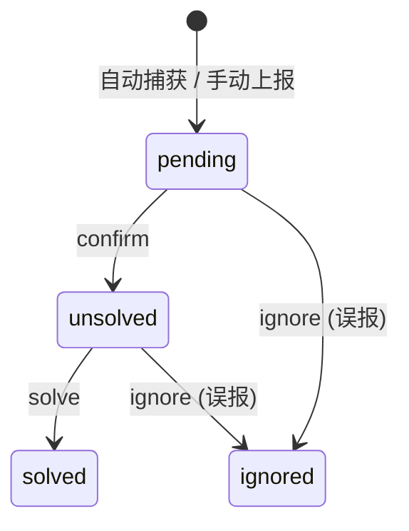

<div align="center">
    <a href="https://v2.nonebot.dev/store">
    </a>

## ✨ nonebot-plugin-ruok ✨
[](./LICENSE)
[](https://pypi.python.org/pypi/nonebot-plugin-ruok)
[](https://www.python.org)
[](https://github.com/astral-sh/uv)
<br/>
[](https://github.com/astral-sh/ruff)
[](https://github.com/p0rt39/nonebot-plugin-ruok)
[](https://results.pre-commit.ci/latest/github/p0rt39/nonebot-plugin-ruok/master)

</div>

## 📖 介绍

RuOK 是一个 NoneBot2 **健康监控 + 事件追踪 + WebUI 面板**插件，零侵入设计，无需其他插件配合：

- 🔍 **硬件 & 连接监控**：CPU / 内存 / 磁盘 / 网络 + WS 连接状态 + e2e 延迟
- 📋 **插件内省**：自动扫描所有已加载插件的 Matcher、元信息、加载状态
- 🚨 **日志错误自动捕获**：loguru sink 全局拦截 ERROR，自动创建追踪 Session
- 📝 **手动问题上报**：用户通过 `/ruok no <模块> <描述>` 主动报告，自动捕获上报者信息
- 🔄 **Session 状态机**：`pending(🟡)→unsolved(🔴)→solved(🟢)`，支持忽略误报
- 🌐 **HTTP API + WebUI**：`/ruok/api/*` JSON 接口 + `/ruok` 可视化面板，同一端口
- 📡 **SSE 实时推送**：Dashboard 实时状态更新 + Session 变更即时通知
- 📊 **数据可视化**：CPU/内存趋势折线图 + Session 状态饼图（Chart.js）
- 🔐 **WebUI 分级鉴权**：内置管理员 + 普通用户账号，支持聊天平台账号绑定上报
- � **通知引擎**：多规则、冷却期、Bot 私聊 + Webhook 双通道



## 💿 安装

```bash
# nb-cli（推荐）
nb plugin install nonebot-plugin-ruok --upgrade

# uv
uv add nonebot-plugin-ruok

# pdm
pdm add nonebot-plugin-ruok

# poetry
poetry add nonebot-plugin-ruok
```

安装后在 `pyproject.toml` 中注册插件：

```toml
[tool.nonebot]
plugins = ["nonebot_plugin_ruok"]
```

## ⚙️ 配置

在 nonebot2 项目的 `.env` 文件中，添加以下配置项即可。

### 健康检查

| 配置项 | 类型 | 默认值 | 说明 |
| :----- | :--: | :----: | :--- |
| `RUOK__CHECK_TIMEOUT` | `float` | `5.0` | 健康检查超时时间（秒） |
| `RUOK__WS_DEEP_CHECK_TIMEOUT` | `float` | `3.0` | WS 深度检查超时（秒），`bot.get_status()` 最大等待 |
| `RUOK__CACHE_TTL` | `float` | `10.0` | API 缓存有效期（秒），减少重复采集 |
| `RUOK__ENABLE_DEEP_WS_CHECK` | `bool` | `True` | 是否执行 e2e 延迟检测（`get_status()`） |

### Session 追踪

| 配置项 | 类型 | 默认值 | 说明 |
| :----- | :--: | :----: | :--- |
| `RUOK__SESSION_ENABLED` | `bool` | `True` | 是否启用 Session 系统 |
| `RUOK__AUTO_SESSION_ENABLED` | `bool` | `True` | 是否自动捕获 ERROR 日志生成 Session |
| `RUOK__STRICT_EXCEPTION_CAPTURE` | `bool` | `False` | True=捕获所有 stdlib ERROR，False=仅框架级（uvicorn/starlette/fastapi/asyncio） |
| `RUOK__CRISIS_MODE` | `bool` | `False` | 紧急模式：跳过所有上报权限检查（测试/紧急用） |
| `RUOK__NOTIFY_SUPERUSERS` | `bool` | `True` | 新 Session 是否私聊通知 SUPERUSERS |
| `RUOK__NOTIFY_INTERVAL_HOURS` | `float` | `4.0` | 同一 Session 再次通知的最小间隔（小时） |
| `RUOK__SUMMARY_INTERVAL_HOURS` | `float` | `4.0` | 定时汇总未解决 Session 的间隔（小时） |

### 权限控制

| 配置项 | 类型 | 默认值 | 说明 |
| :----- | :--: | :----: | :--- |
| `RUOK__REPORT_WHITELIST_USERS` | `list[str]` | `[]` | 允许上报问题的用户白名单（平台用户 ID 字符串） |
| `RUOK__REPORT_WHITELIST_GROUPS` | `list[str]` | `[]` | 允许上报问题的群白名单（群号字符串） |

**上报权限判断优先级**：
> SUPERUSERS → 白名单用户 → 群管理员/群主 → 白名单群群员

**`crisis_mode=True` 时全部跳过** *(启发自Cloudflare的Zero Trust Mode，Reversed)* 。

### API / WebUI

| 配置项 | 类型 | 默认值 | 说明 |
| :----- | :--: | :----: | :--- |
| `RUOK__CORS_ORIGINS` | `list[str]` | `["*"]` | CORS 允许的源列表 |
| `RUOK__API_KEY` | `str` | `""` | API 密钥（为空则不校验） |
| `RUOK__WEBUI_ADMIN_PASSWORD` | `str` | `""` | WebUI 内置管理员 `admin` 的登录密码（为空则 WebUI 无法登录） |
| `RUOK__SSE_PUBLIC` | `bool` | `False` | True 时 SSE 端点无需登录 |

### 时间序列指标

| 配置项 | 类型 | 默认值 | 说明 |
| :----- | :--: | :----: | :--- |
| `RUOK__METRICS_RETENTION_DAYS` | `int` | `7` | Dashboard 趋势图数据保留天数 |

### 通知规则

`RUOK__NOTIFICATION_RULES` 为 JSON 数组，每项结构：

| 字段 | 类型 | 说明 |
| :--- | :--- | :--- |
| `name` | `str` | 规则名称 |
| `enabled` | `bool` | 是否启用（默认 `true`） |
| `on_status` | `list[str]` | 触发通知的 Session 状态，如 `["pending", "unsolved"]` |
| `on_module` | `list[str]` | 适用模块名列表（空 = 全部） |
| `cooldown_minutes` | `float` | 同规则冷却时间（分钟，默认 `60.0`） |
| `channels` | `list[str]` | 通知通道：`bot_dm`（Bot 私聊）、`webhook`（HTTP POST） |
| `webhook_url` | `str` | `webhook` 通道的目标 URL

### 配置示例

```dotenv
# .env
RUOK__CHECK_TIMEOUT=10.0
RUOK__CACHE_TTL=30.0
RUOK__ENABLE_DEEP_WS_CHECK=true
RUOK__AUTO_SESSION_ENABLED=true
RUOK__NOTIFY_SUPERUSERS=true
RUOK__REPORT_WHITELIST_USERS=["123456789", "987654321"]
RUOK__REPORT_WHITELIST_GROUPS=["1000000"]
RUOK__WEBUI_ADMIN_PASSWORD=mysecret
RUOK__METRICS_RETENTION_DAYS=7
RUOK__NOTIFICATION_RULES='[{"name":"默认通知","enabled":true,"on_status":["pending","unsolved"],"on_module":[],"cooldown_minutes":60,"channels":["bot_dm"]}]'
```

## 🎉 使用

### 聊天指令

| 指令 | 权限 | 范围 | 说明 |
| :--- | :--- | :--- | :--- |
| `/ruok` | 所有人 | 群聊/私聊 | 显示帮助信息 |
| `/ruok status` | 所有人 | 群聊/私聊 | 查看所有模块实时状态（🟢🟡🔴） |
| `/ruok bind <auth_key>` | 普通 WebUI 用户 | 群聊/私聊 | 将 WebUI 账户绑定到当前聊天平台用户 |
| `/ruok no <模块> <描述>` | 已绑定用户/白名单/群管/SUPERUSER | 群聊/私聊 | 手动上报问题，创建 Session |
| `/ruok list` | 所有人 | 群聊/私聊 | 列出活跃 Session（最多 10 条） |
| `/ruok lookup <id>` | 所有人 | 群聊/私聊 | 查看 Session 详情（含重复次数、关联） |
| `/ruok confirm <id>` | SUPERUSER | 群聊/私聊 | 确认问题 → `pending→unsolved` |
| `/ruok solve <id>` | SUPERUSER | 群聊/私聊 | 标记已解决 → `solved` |
| `/ruok ignore <id>` | SUPERUSER | 群聊/私聊 | 忽略误报 → `ignored` |

### HTTP API

所有接口前缀 `/ruok/api`，返回 JSON。

**健康检查**

| 端点 | 方法 | 说明 |
| :--- | :--: | :--- |
| `/ruok/api/status` | GET | 聚合健康状态（硬件 + 连接 + 插件 + 模块） |
| `/ruok/api/health` | GET | 简单探针，200 或 503（K8s / Docker / Uptime） |
| `/ruok/api/connections` | GET | 仅 WS 连接状态（轻量） |

**Session 管理**

| 端点 | 方法 | 说明 |
| :--- | :--: | :--- |
| `/ruok/api/sessions` | GET | Session 列表，支持 `?status=&module=&reporter=&search=&plugin=&after=&before=` |
| `/ruok/api/sessions` | POST | 创建 Session（WebUI 用） |
| `/ruok/api/sessions/stats` | GET | 聚合统计（pending/unsolved/solved/ignored） |
| `/ruok/api/sessions/{id}` | GET | Session 详情 |
| `/ruok/api/sessions/{id}` | PATCH | 更新状态 / 开发者备注 |
| `/ruok/api/sessions/{id}/link/{other}` | POST | 关联两个 Session |
| `/ruok/api/sessions/{id}/link` | DELETE | 解除关联 |
| `/ruok/api/sessions/{id}/linked` | GET | 获取同组关联的 Session 列表 |

**模块管理**

| 端点 | 方法 | 说明 |
| :--- | :--: | :--- |
| `/ruok/api/modules` | GET | 模块列表（含实时推导状态） |
| `/ruok/api/modules/{name}` | GET / PUT / DELETE | 模块 CRUD |

**指标**

| 端点 | 方法 | 说明 |
| :--- | :--: | :--- |
| `/ruok/api/metrics/history` | GET | 时间序列数据，`?hours=24`（Dashboard 图表数据源） |

### WebUI

启动机器人后，浏览器访问 `http://<host>:<port>/ruok` 即可打开可视化面板。

| 页面 | 路由 | 说明 |
| :--- | :--- | :--- |
| 📊 总览 | `/ruok` | 系统指标卡片 + 连接状态 + CPU/内存趋势图 + Session 统计饼图 + 模块表 |
| 📋 Sessions | `/ruok/sessions` | 列表 + 高级筛选（搜索、状态、模块、插件、时间范围） |
| 📝 详情 | `/ruok/sessions/{id}` | 完整信息 + 状态时间线 + 关联 Session + 开发者备注 |
| 📦 模块 | `/ruok/modules` | 模块定义 CRUD（名称、显示名、关联插件） |
| 🔔 通知 | `/ruok/notifications` | 通知规则管理（触发条件、冷却、通道） |
| 🔐 登录 | `/ruok/login` | 管理员账号固定为 `admin`，密码来自 `RUOK__WEBUI_ADMIN_PASSWORD` |
| 🧾 注册 | `/ruok/register` | 普通用户注册，生成 10 分钟有效的一次性绑定码 |

管理员可访问完整 WebUI。普通用户只能访问精简总览、模块健康状态、绑定提示、手动上报入口和自己的上报记录；普通用户必须先通过 `/ruok bind <auth_key>` 绑定当前聊天平台账号后才能使用 WebUI 上报。

当前主要测试适配器为 OneBot V11。绑定机制基于 NoneBot `Event.get_user_id()` 和 `Bot.type` 记录平台用户身份，理论上可用于其他适配器，但非 OneBot 场景未作为主支持路径保证。

**技术架构**

| 层级 | 技术 | 用途 |
|------|------|------|
| 模板 | Jinja2 | SSR 页面渲染 |
| 交互 | HTMX 2.x | 局部刷新、内联编辑 |
| 实时 | SSE | ~1s 指标更新 + Session 变更推送 |
| 样式 | Pico.css + 自定义 CSS | Glass 风格暗色模式 |
| 图表 | Chart.js | 趋势折线图 + 状态饼图 |
| DOM | idiomorph | Hero 区域 morph 过渡 |

## 🏗️ 项目结构

```
src/nonebot_plugin_ruok/
├── __init__.py          # 入口：PluginMetadata + 7 个 Matcher + WS 钩子 + 挂载
├── config.py            # Pydantic 配置模型（ruok__ 作用域）
├── protocol.py          # 全部数据模型
├── api.py               # FastAPI JSON 路由（/ruok/api/*）
├── collector.py         # 薄重导出层 → collectors/
├── collectors/          # 核心引擎
│   ├── metrics.py       # 系统指标 + WS 连接 + 插件清单 + 聚合
│   ├── sessions.py      # Session CRUD + 关联 + 统计 + 错误处理
│   ├── modules.py       # 模块定义 CRUD + 状态推导
│   ├── monitor.py       # LogMonitor（loguru + stdlib）
│   ├── notifications.py # 通知引擎（规则/冷却/BotDM/Webhook）
│   └── trackers.py      # 网络/磁盘速率追踪
└── webui/               # Web 面板
    ├── router.py        # SSR 路由（页面 + HTMX partial + action）
    ├── auth.py          # WebUI 登录认证
    ├── sse.py           # EventBus + SSE 流生成器
    ├── jinja.py         # Jinja2 环境 + 自定义 filter
    └── templates/       # 18 个 Jinja2 模板
```

## 📄 许可证

MIT © [p0rt39](https://github.com/p0rt39)
