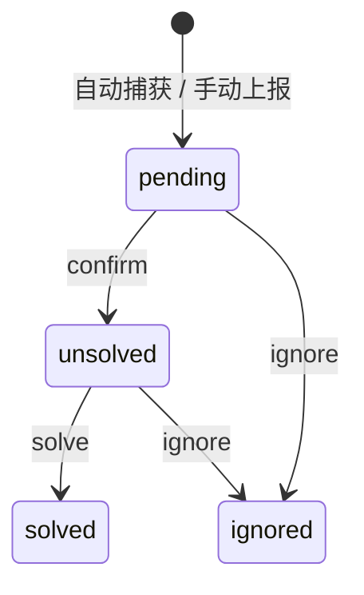

<div align="center">
    <a href="https://v2.nonebot.dev/store">
    </a>

# Nonebot, RUOK? - RUOK

**NoneBot2 健康监控、异常 Session 追踪与 WebUI 面板**

[](./LICENSE)
[](https://pypi.python.org/pypi/nonebot-plugin-ruok)
[](https://www.python.org)
[](https://github.com/astral-sh/uv)
<br/>
[](https://github.com/astral-sh/ruff)
[](./LICENSE)

</div>

## 介绍

`Nonebot, RUOK?` (RUOK) 是一个面向 NoneBot2 的运行状态观察与异常处理插件。它会收集系统指标、Bot 连接状态、已加载插件信息，自动捕获 ERROR/CRITICAL 日志生成可追踪 Session，并提供 SSR WebUI、HTTP API、通知规则与聊天指令。

核心能力：

- 系统指标：CPU、内存、磁盘、网络、进程、运行时间。
- 连接监控：Bot 连接/断开、适配器、自身 ID、可选深度延迟检查。
- 插件内省：自动捕获已加载插件、元信息、Matcher、健康提示。
- Session 追踪：自动捕获日志错误，支持手动上报、查找、备注、关联、确认、解决、忽略。
- 插件级影响传播：确认 Session 时可指定影响插件，相关模块自动进入 `unavailable`。
- WebUI：完整鉴权、实时更新、关键指标实时显示、Bot用户/Bot开发者双显示模板。
- 账号体系：内置 admin、普通用户注册、平台账号绑定、记住登录、自助重设密码。
- 通知规则：按状态/模块触发，支持 Bot 私聊与 Webhook，带冷却时间。
- API：`/ruok/api/*` JSON 接口，受 API key 保护，为外接 Status Page 等留下空间。


## 使用前的提示

本插件的前端相关代码由Codex基于`L1nk Workflow`自主迭代构建，经作者人工测试后投入使用。

但由于作者技术力不足，现在的项目架构亟待优化。欢迎您提交Issue；也欢迎和感谢您通过提交Pull Request为本项目做出贡献。

## 快速启动

如果您是第一次接入 RUOK，建议按照以下步骤进行。

### 1. 安装插件

推荐使用 nb-cli：

```bash
nb plugin install nonebot-plugin-ruok
```

也可以使用常见 Python 包管理器：

```bash
uv add nonebot-plugin-ruok
pdm add nonebot-plugin-ruok
poetry add nonebot-plugin-ruok
```

### 2. 注册插件

通常，nb-cli会自动为您处理本节内容。

如果安装工具没有自动写入 NoneBot 配置，请在 NoneBot 项目的 `pyproject.toml` 中注册插件：

```toml
[tool.nonebot]
plugins = ["nonebot_plugin_ruok"]
```

### 3. 写入推荐最小配置

本插件 **依赖** FastAPI 驱动器来正常工作，请保证驱动器安装和启用。

本插件可以零配置加载，但为了启用 WebUI 管理员登录并保证重启后的登录体验，建议至少配置：

```dotenv
RUOK__WEBUI_ADMIN_PASSWORD=change-me
RUOK__WEBUI_SECRET_KEY=replace-with-a-long-random-secret
RUOK__API_KEY=replace-with-a-long-random-api-token
```

`RUOK__API_KEY` 是 HTTP API 的访问凭据。除 `/ruok/api/health` 外，所有 API
端点都要求携带该 key；未配置 key 时这些端点会返回 `401`。这不会影响插件内部
状态采集、聊天指令或 WebUI 使用。

虽然 WebUI 和 API 挂载在Nonebot Uvicorn 上，Uvicorn 默认只监听 `localhost`，但考虑到您可能有通过 Tunnel、反向代理等方式向外暴露或者修改 Nonebot Uvicorn 的监听行为的需求，建议在安装阶段就配置 API key。

如果`RUOK__WEBUI_ADMIN_PASSWORD`未配置，WebUI将**不可用**。

如果没有配置 `RUOK__WEBUI_SECRET_KEY`，WebUI session 会使用启动时随机密钥。这不会影响本次运行内的登录、注册、绑定等功能，但 Bot 重启后旧登录态和“保持登录”cookie 无法继续校验，用户需要重新登录。

### 4. 启动并访问 WebUI

WebUI是本插件的核心功能之一，可以帮助Bot开发者摆脱繁琐的聊天窗口命令输入。而且，许多高级配置和安装后初始化定制依赖WebUI来进行。

**因此，请务必在安装后验证WebUI可访问性。**

启动 Bot 后访问：

```text
http://<host>:<port>/ruok
```

内置管理员账号固定为：

```text
username: admin
password: RUOK__WEBUI_ADMIN_PASSWORD
```

**如果WebUI不可用，请检查`RUOK__WEBUI_ADMIN_PASSWORD`是否配置。**

### 5. 验证聊天命令

在聊天中发送：

```text
/ruok status
/ruok list
```

`/ruok status` 应返回模块实时状态，`/ruok list` 会列出当前用户可见的 Session。SUPERUSER 还可以发送：

```text
/ruok raise quickstart
```

这会触发一次受控内部异常，用于验证 RUOK 的自动 Session 捕获流程。随后可通过 `/ruok list`、`/ruok lookup <id>` 和 `/ruok solve <id>` 检查并处理该 Session。

### 适配器提示

RUOK 设计上不绑定具体适配器，但当前主要针对 OneBot V11 做了优化。非 OneBot V11 适配器可以使用，也欢迎提交 Issue；只是支持效率可能低于主线适配器。

### 接下来可以做什么

- 在 WebUI 的通知页面配置新 Session 通知规则。
- 阅读“聊天指令”了解权限和 Session 处理命令。
- 阅读“聊天图片渲染”启用 `/ruok status`、`/ruok list` 图片输出。
- 阅读“HTTP API”将 RUOK 状态接入外部监控或自动化流程。

## 配置项

所有配置位于 `.env` 中的 `RUOK__...` 作用域。

### 健康检查

| 配置项 | 类型 | 默认值 | 说明 |
| :--- | :--- | :--- | :--- |
| `RUOK__CHECK_TIMEOUT` | `float` | `5.0` | 健康检查超时时间，单位秒 |
| `RUOK__WS_DEEP_CHECK_TIMEOUT` | `float` | `3.0` | Bot 深度检查超时时间 |
| `RUOK__CACHE_TTL` | `float` | `10.0` | API 聚合状态缓存时间 |
| `RUOK__ENABLE_DEEP_WS_CHECK` | `bool` | `true` | 是否调用 `bot.get_status()` 与各Bot做端到端检查 |

### Session 与上报

| 配置项 | 类型 | 默认值 | 说明 |
| :--- | :--- | :--- | :--- |
| `RUOK__SESSION_ENABLED` | `bool` | `true` | 是否启用 Session 系统 |
| `RUOK__AUTO_SESSION_ENABLED` | `bool` | `true` | 是否自动捕获日志错误生成 Session |
| `RUOK__STRICT_EXCEPTION_CAPTURE` | `bool` | `false` | 是否捕获所有 stdlib ERROR/CRITICAL；默认只捕获框架相关 logger |
| `RUOK__REPORT_WHITELIST_USERS` | `list[str]` | `[]` | 上报白名单用户 ID |
| `RUOK__REPORT_WHITELIST_GROUPS` | `list[str]` | `[]` | 上报白名单群 ID |
| `RUOK__CRISIS_MODE` | `bool` | `false` | 危机模式，跳过上报权限检查 |
| `RUOK__SUMMARY_INTERVAL_HOURS` | `float` | `4.0` | 未解决 Session 汇总通知间隔 |

上报权限顺序：

1. `RUOK__CRISIS_MODE=true`
2. NoneBot `SUPERUSERS`
3. 已绑定 WebUI 用户
4. `RUOK__REPORT_WHITELIST_USERS`
5. 群管理员或群主
6. `RUOK__REPORT_WHITELIST_GROUPS` 中的 `Member`

若鉴权时上报用户不符合其上所有条件，插件将拒绝上报和创建Session.

### API 与 WebUI

| 配置项 | 类型 | 默认值 | 说明 |
| :--- | :--- | :--- | :--- |
| `RUOK__CORS_ORIGINS` | `list[str]` | `["*"]` | API CORS 允许源 |
| `RUOK__API_KEY` | `str` | `""` | HTTP API key；除 `/ruok/api/health` 外的 API 端点必须配置 |
| `RUOK__WEBUI_ADMIN_PASSWORD` | `str` | `""` | 内置 `admin` 账户密码；为空则 WebUI 无法登录 |
| `RUOK__WEBUI_SECRET_KEY` | `str` | `""` | WebUI session 签名密钥；为空则每次启动随机，重启后登录态/保持登录功能会失效 |
| `RUOK__SSE_PUBLIC` | `bool` | `false` | 是否允许未登录访问 SSE |

API key 可通过任一方式传递：

```http
X-RUOK-API-Key: your-token
Authorization: Bearer your-token
```

### 指标

| 配置项 | 类型 | 默认值 | 说明 |
| :--- | :--- | :--- | :--- |
| `RUOK__METRICS_RETENTION_DAYS` | `int` | `7` | 指标数据保留天数 |

### 聊天图片渲染

RUOK 默认依赖 `nonebot-plugin-htmlrender`，可将 `/ruok status` 和 `/ruok list`
渲染成图片发送。

默认仍使用文本输出；图片渲染失败、浏览器不可用或适配器不支持图片时，
会自动回退文本结果。

| 配置项 | 类型 | 默认值 | 说明 |
| :--- | :--- | :--- | :--- |
| `RUOK__CHAT_RENDER_MODE` | `"text" \| "image"` | `"text"` | 聊天命令输出模式 |
| `RUOK__CHAT_RENDER_TIMEOUT` | `float` | `8.0` | 图片渲染超时时间，单位秒 |

### 通知规则

新 Session 即时通知由通知规则系统统一处理，覆盖聊天上报、WebUI 上报、API 创建
和自动日志捕获。`RUOK__NOTIFICATION_ENABLED=false` 会关闭全部即时通知；定时汇总仍
由 `RUOK__SUMMARY_INTERVAL_HOURS` 单独控制。

通知规则仅通过 WebUI 创建、编辑和删除，并持久化到插件 data 目录的
`notification_rules.json`。未创建任何规则时，RUOK 会自动创建一条 `superusers`
默认规则，通过 Bot 私聊通知 NoneBot `SUPERUSERS`。

| 配置项 | 类型 | 默认值 | 说明 |
| :--- | :--- | :--- | :--- |
| `RUOK__NOTIFICATION_ENABLED` | `bool` | `true` | 是否启用新 Session 即时通知规则 |

| 字段 | 类型 | 说明 |
| :--- | :--- | :--- |
| `name` | `str` | 规则名，唯一键 |
| `enabled` | `bool` | 是否启用 |
| `on_status` | `list[str]` | 触发状态，例如 `["pending", "unsolved"]` |
| `on_module` | `list[str]` | 触发模块；空列表表示全部模块 |
| `cooldown_minutes` | `float` | 同规则冷却时间 |
| `channels` | `list[str]` | `bot_dm`、`webhook` |
| `webhook_url` | `str | null` | Webhook URL |

## 聊天指令

| 指令 | 权限 | 说明 |
| :--- | :--- | :--- |
| `/ruok` | 所有人 | 显示帮助 |
| `/ruok status` | 所有人 | 查看模块实时状态 |
| `/ruok list` | 所有人 | 普通用户查看自己最近 5 个 Session；SUPERUSER 查看最近 15 个活跃 Session |
| `/ruok lookup <id>` | 所有人 | 普通用户只能查看自己的 Session；SUPERUSER 可查看任意 Session |
| `/ruok bind <auth_key>` | 普通 WebUI 用户 | 绑定 WebUI 账号与当前平台用户 |
| `/ruok reset` | 已绑定普通 WebUI 用户 | 生成一次性密码重置码；群聊触发时通过私聊发送 |
| `/ruok no <模块> <描述>` | 有上报权限的用户 | 手动上报问题，创建 Session |
| `/ruok confirm <id> [插件...]` | SUPERUSER | 确认问题，可指定一个或多个影响插件 |
| `/ruok solve <id>` | SUPERUSER | 标记已解决 |
| `/ruok ignore <id>` | SUPERUSER | 忽略误报 |
| `/ruok raise [message]` | SUPERUSER | 触发一次受控内部异常，验证 RUOK 自监控 Session 创建流程 |
| `/ruok test [message]` | SUPERUSER | `/ruok raise [message]` 的别名|

普通用户的 `list`/`lookup` 可见范围按 `(platform, user_id)` 与当前聊天平台身份精确匹配；
WebUI 普通用户手动上报也使用其已绑定的平台身份。不同平台的同名用户 ID 互不继承绑定
权限。显式配置的 `SUPERUSERS` 和上报白名单仍按原有 ID 规则授权。

旧版 `bound_qq` 或缺少平台字段的绑定记录会保留，但不再作为上报、WebUI Session 查看、
动态管理员或密码重置的授权依据。登录 WebUI 后重新生成绑定码，并在当前聊天平台发送
`/ruok bind <auth_key>` 即可完成迁移；忘记密码的旧账号需由管理员重设密码。
历史上未记录平台或仅标记为 `webui` 的 Session 不会自动归属给同 ID 用户，仍可由管理员
查看。升级前签发的重置码需重新获取，换绑或清除绑定后原重置码立即失效。

`/ruok confirm` 的插件参数支持空格或逗号：

```text
/ruok confirm ruok-1234abcd nonebot_plugin_a nonebot_plugin_b
/ruok confirm ruok-1234abcd nonebot_plugin_a,nonebot_plugin_b
```

不传入插件名参数时，Session 仍会从 `pending` 变为 `unsolved`，但不会产生插件级传播影响。

## Session 状态与插件影响传播

Session 状态机：



模块状态由 Session 动态推导：

- 本模块有 `pending` Session：模块为 `degraded`。
- 本模块有 `unsolved` Session：模块为 `unavailable`。
- 某模块有 `pending` Session：该模块当前关联的所有插件会传播 `degraded` 到共享插件的模块。
- 某 Session 被 confirm 且指定 `affected_plugins`：共享这些插件的模块会进入 `unavailable`。
- confirm 不指定插件：仅原模块直接 `unavailable`，不传播。
- 同一插件仍有其他活跃 Session 时，解决其中一个不会提前恢复模块状态。

确认后的影响插件可以在 WebUI Session 列表或详情页继续修改。修改后，旧插件影响会解除，新插件影响会重新计算。

## WebUI

访问 `/ruok` 打开 WebUI。

### 管理员

管理员包括：

- 内置 `admin` 账户。
- 已绑定平台账号且平台用户 ID 命中 NoneBot `SUPERUSERS` 的普通 WebUI 用户。

管理员可访问：

| 页面 | 路由 | 说明 |
| :--- | :--- | :--- |
| 总览 | `/ruok` | 系统指标、连接、插件、模块、趋势、Session 统计 |
| Sessions | `/ruok/sessions` | 搜索、筛选、确认、解决、忽略、关联、备注 |
| Session 详情 | `/ruok/sessions/{id}` | 完整信息、用户说明、Traceback、关联 Session、影响插件 |
| 模块 | `/ruok/modules` | 模块列表与创建 |
| 模块详情 | `/ruok/modules/{name}` | 编辑名称、显示名、描述、关联插件、删除 |
| 通知 | `/ruok/notifications` | 通知规则列表与创建 |
| 通知详情 | `/ruok/notifications/{name}` | 编辑规则、触发状态、模块、冷却、通道、删除 |
| 用户 | `/ruok/users` | 用户搜索、创建、改名、重置密码、绑定码、清除绑定、删除 |

### 普通用户

普通用户可注册 WebUI 账号。注册后页面会显示 10 分钟有效的一次性 `auth_key`，用户需要在聊天中发送：

```text
/ruok bind <auth_key>
```

普通用户可访问：

- 精简总览。
- Overall 和模块健康状态。
- 自己的绑定状态。
- WebUI 手动上报入口。
- 自己上报的 Session。
- 账号自助页面：修改密码、重新生成绑定码、注销账号。

普通用户不能访问模块管理、通知管理、全局 Sessions、系统指标详情、趋势数据和管理动作。

### 登录体验

登录页支持：

- 浏览器/系统密码管理器的 `autocomplete`。
- 记住用户名 cookie。
- 保持登录 30 天的可撤销 token cookie。
- 忘记密码入口。

应用不会保存明文密码。普通用户密码使用 PBKDF2-HMAC-SHA256 加盐哈希。保持登录 token 存储为哈希，修改密码、重设密码、删除账号或管理员密码变化后会失效。
如果未配置固定的 `RUOK__WEBUI_SECRET_KEY`，这些 token 只能在当前进程生命周期内正常使用；
Bot 重启后会因 session 签名密钥变化而要求重新登录。

## HTTP API

所有端点前缀为 `/ruok/api`，返回 JSON。API 鉴权与 WebUI 登录态相互独立。
除 `/ruok/api/health` 外，请求必须配置 `RUOK__API_KEY` 并带上以下任一凭据；
未配置 key 时，受保护端点默认拒绝访问。`/ruok/api/health` 只返回简单健康结果，
可在未配置 key 时用于容器或负载均衡探针。

```http
X-RUOK-API-Key: your-token
Authorization: Bearer your-token
```

### 健康与指标

| 方法 | 端点 | 说明 |
| :--- | :--- | :--- |
| `GET` | `/ruok/api/status` | 聚合健康状态，包含 overall、连接、插件、模块状态原因 |
| `GET` | `/ruok/api/health` | 简单健康探针；健康返回 200，不可用返回 503 |
| `GET` | `/ruok/api/connections` | Bot 连接状态列表 |
| `GET` | `/ruok/api/metrics/history?hours=24` | 查询最近 `hours` 小时的时间序列指标，范围 0.5 到 168 小时 |

### Session API

| 方法 | 端点 | 说明 |
| :--- | :--- | :--- |
| `GET` | `/ruok/api/sessions` | Session 列表 |
| `POST` | `/ruok/api/sessions` | 创建 Session |
| `GET` | `/ruok/api/sessions/stats` | Session 统计 |
| `GET` | `/ruok/api/sessions/{id}` | Session 详情 |
| `PATCH` | `/ruok/api/sessions/{id}` | 局部更新 Session 状态、开发者备注，或确认影响插件 |
| `POST` | `/ruok/api/sessions/{id}/link/{other}` | 将两个 Session 放入同一关联组 |
| `DELETE` | `/ruok/api/sessions/{id}/link` | 让当前 Session 退出关联组 |
| `GET` | `/ruok/api/sessions/{id}/linked` | 查看同组关联 Session |

`GET /ruok/api/sessions` 支持查询参数：

| 参数 | 说明 |
| :--- | :--- |
| `status` | 状态过滤，可传 `pending`、`unsolved`、`solved`、`ignored`，也可用逗号组合 |
| `module` | 模块名过滤 |
| `reporter` | 上报用户 ID 过滤 |
| `search` | 搜索 Session ID、模块、描述、上报者、错误签名、影响插件 |
| `plugin` | 插件名过滤，包含模块关联插件和已确认的 `affected_plugins` |
| `after` / `before` | ISO datetime 时间范围，例如 `2026-07-01T00:00:00` |

创建 Session：

```http
POST /ruok/api/sessions
Content-Type: application/json

{
  "module_name": "music",
  "description": "播放失败",
  "reporter_type": "user",
  "user_id": "12345678",
  "group_id": "87654321",
  "platform": "OneBot V11",
  "source": "manual"
}
```

修改状态或备注：

```http
PATCH /ruok/api/sessions/ruok-1234abcd
Content-Type: application/json

{
  "status": "solved",
  "developer_notes": "已修复并发布"
}
```

确认并指定影响插件：

```http
PATCH /ruok/api/sessions/ruok-1234abcd
Content-Type: application/json

{
  "status": "unsolved",
  "affected_plugins": ["nonebot_plugin_a", "nonebot_plugin_b"]
}
```

`affected_plugins` 只能随 `status="unsolved"` 一起提交，并会按 Session 原模块当前插件列表校验。非法插件返回 400。

### Module API

| 方法 | 端点 | 说明 |
| :--- | :--- | :--- |
| `GET` | `/ruok/api/modules` | 模块列表，含实时推导状态和状态原因 |
| `GET` | `/ruok/api/modules/{name}` | 模块详情 |
| `PUT` | `/ruok/api/modules/{name}` | 创建或更新指定模块定义 |
| `DELETE` | `/ruok/api/modules/{name}` | 删除模块定义 |

创建或更新模块：

```http
PUT /ruok/api/modules/music
Content-Type: application/json

{
  "display_name": "音乐",
  "plugins": ["nonebot_plugin_music", "nonebot_plugin_playlist"],
  "description": "音乐相关功能"
}
```

删除模块：

```http
DELETE /ruok/api/modules/music
```

### 常见状态码

| 状态码 | 含义 |
| :--- | :--- |
| `200` | 请求成功 |
| `400` | 请求内容不合法，例如影响插件不属于 Session 原模块 |
| `401` | API key 未配置、缺失或错误 |
| `403` | Session 系统被禁用，相关写操作不可用 |
| `404` | Session 或模块不存在 |
| `503` | `/health` 探针判断服务不可用 |

## 数据文件

RUOK 使用 `nonebot-plugin-localstore` 的插件数据目录。

| 文件 | 说明 |
| :--- | :--- |
| `sessions/{session_id}.json` | Session 事实源 |
| `plugin_impacts.json` | 从活跃 Session 重建的插件影响索引 |
| `modules.json` | 模块定义 |
| `notification_rules.json` | 通知规则 |
| `notification_cooldowns.json` | 通知冷却状态 |
| `metrics/YYYY-MM-DD.json` | 每日指标数据 |
| `webui_users.json` | 普通 WebUI 用户、绑定码、平台绑定、重置 key |
| `webui_remember_tokens.json` | 记住登录 token 哈希 |

`plugin_impacts.json` 是缓存，不是权威状态。缺失、损坏或过期时会从 Session 文件重建。

Session、插件影响索引和每日指标的文件写入在进程内使用锁，并通过同目录临时文件和原子替换
完成，避免并发请求互相覆盖或留下半截 JSON。指标文件若已损坏，会先保留为带有
`.corrupt-...` 后缀的隔离副本并记录告警，再创建新的当天文件。锁只覆盖当前进程；多进程
同时使用同一数据目录时，应改用文件锁或事务型存储。

## 前端静态资产及其许可证

WebUI 使用随包分发的本地静态资产，不依赖运行时 CDN：

| 资产 | 版本 | 许可证 | 包内路径 |
| :--- | :--- | :--- | :--- |
| Pico CSS | `2.1.1` | MIT | `webui/static/vendor/pico/` |
| htmx | `2.0.8` | 0BSD | `webui/static/vendor/htmx/` |
| Idiomorph | `0.7.4` | 0BSD | `webui/static/vendor/idiomorph/` |
| Chart.js | `4.5.1` | MIT | `webui/static/vendor/chartjs/` |

这些文件通过 `/ruok/static/vendor/...` 提供给浏览器，安装包内已保留对应
`LICENSE` / `LICENSE.md` 文件。

## 项目结构

```text
src/nonebot_plugin_ruok/
├── __init__.py          # 插件入口、命令、NoneBot 生命周期、路由挂载
├── config.py            # RUOK__ 配置模型
├── protocol.py          # Pydantic 数据模型
├── api.py               # /ruok/api/* JSON API
├── collector.py         # collectors 的兼容重导出层
├── collectors/
│   ├── metrics.py       # 系统指标、连接、插件内省、聚合状态
│   ├── sessions.py      # Session CRUD、关联、统计、插件影响索引
│   ├── modules.py       # 模块 CRUD、状态推导、相关 Session 查询
│   ├── monitor.py       # loguru / stdlib 日志捕获
│   ├── notifications.py # 通知规则、冷却、Bot DM、Webhook、汇总任务
│   └── trackers.py      # 网络和磁盘 I/O 速率追踪
└── webui/
    ├── auth.py          # WebUI 账号、绑定、记住登录、密码重设
    ├── router.py        # SSR 页面、HTMX partial/action、SSE
    ├── sse.py           # EventBus 和 SSE 生成器
    ├── jinja.py         # Jinja 环境和过滤器
    ├── static/          # WebUI 本地静态资产及第三方许可证
    └── templates/       # Jinja2 页面与 partial
```

测试位于 `tests/`：

- `conftest.py`：测试环境初始化，注册 OneBot V11 适配器并从 `pyproject.toml` 加载插件。
- `fake.py`：构造 OneBot V11 群聊/私聊假事件。
- `webui_test_utils.py`：FastAPI `TestClient`、WebUI 登录、模块/通知测试辅助函数。
- `plugin_test.py`：NoneBot `/ruok` 命令、绑定、重设密码、状态查询、确认/解决等交互测试。
- `test_collector.py`：指标采集、进程快照、网络/磁盘速率追踪。
- `test_sessions.py`：Session CRUD、筛选、搜索、关联、统计、插件影响索引。
- `test_modules.py`：模块 CRUD、直接/插件传播状态推导、相关 Session 查询。
- `test_web_api.py`：API key 与路由优先级回归测试。
- `test_web_api_auth.py`：登录、注册、绑定、记住登录、密码重设、鉴权边界。
- `test_web_api_dashboard.py`：管理员/普通用户 Dashboard、趋势图和趋势数据端点。
- `test_web_api_sessions.py`：Session WebUI、Session API、影响插件编辑。
- `test_web_api_modules.py`：模块 WebUI 列表、详情、编辑、删除。
- `test_web_api_notifications.py`：通知规则 WebUI 列表、详情、编辑、删除。
- `test_web_api_users.py`：用户管理与普通用户自助账号操作。

## 开发

推荐使用 `uv`：

```powershell
uv sync --all-groups
```

常用检查：

```powershell
uv run ruff check .
uv run ruff format --check .
uv run pyright
uv run pytest
```

项目使用 `prek` 执行 `.pre-commit-config.yaml` 中定义的 hooks，包含 ruff、typos、uv lock/sync 等检查：

```powershell
prek run --all-files
```

## 鸣谢

### [NoneBot2](https://nonebot.dev/) 及其社区生态

提供独一无二的Bot框架，和独一无二的社区开发者们。

### [kexue-z/nonebot-plugin-htmlrender](https://github.com/kexue-z/nonebot-plugin-htmlrender)

为聊天命令图片渲染提供 HTML 截图能力。

### [giampaolo/psutil](https://github.com/giampaolo/psutil)

支撑系统指标采集功能。

### [Jinja2](https://jinja.palletsprojects.com/)
支持 WebUI 模板渲染。

### [FastAPI](https://fastapi.tiangolo.com/)、[Starlette](https://www.starlette.io/) 
支持 WebUI 和 API。

### [Pico CSS](https://picocss.com/)、[htmx](https://htmx.org/)、[bigskysoftware/Idiomorph](https://github.com/bigskysoftware/idiomorph)、[Chart.js](https://www.chartjs.org/) 

支撑 WebUI 的样式、交互与图表展示。

>第三方前端资产的许可证信息见“前端静态资产及其许可证”。

## 许可证

Apache License 2.0 © [p0rt39](https://github.com/p0rt39)
